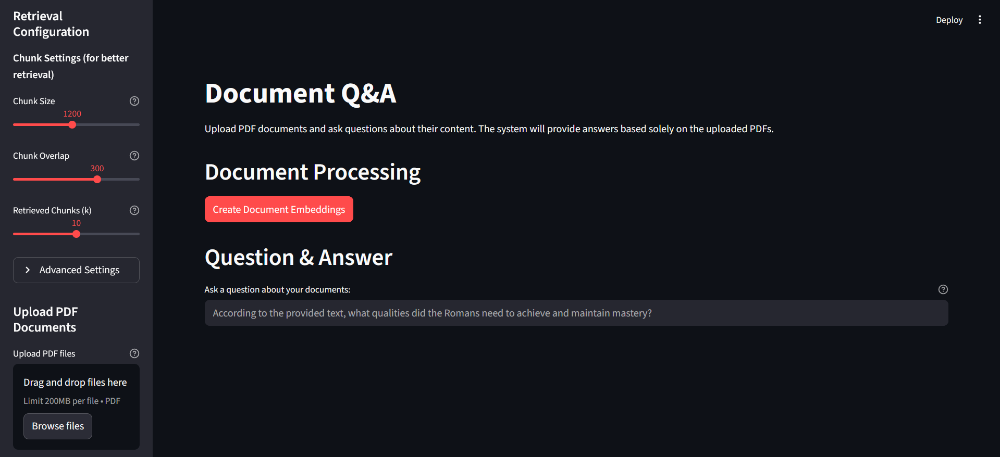
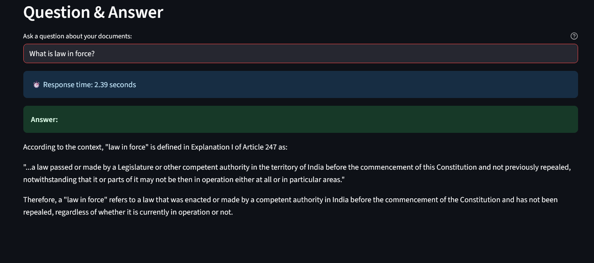

# 📚 Document Q&A: Intelligent PDF Question-Answering System

Welcome to **Document Q&A**, a sleek and powerful **Streamlit application** that lets you upload PDF documents and ask precise questions about their content.  
Built with **LangChain**, **Groq**, and **Google Generative AI**, this tool delivers **accurate, document-grounded answers** — perfect for researchers, students, and professionals.

---

## 🌟 Features
- 📂 **Effortless PDF Upload** – Upload multiple PDFs via a simple interface.  
- 🔎 **Advanced Retrieval** – FAISS + Google Generative AI embeddings with tunable chunking & MMR for diverse results.  
- 📑 **Strict Grounding** – Answers come **only** from uploaded documents.  
- ⚙️ **Customizable Parameters** – Chunk size, overlap, retrieval count, thresholds.  
- ⏳ **Real-Time Feedback** – Progress spinners, status updates, and response timing.  
- 🎨 **Modern UI** – Clean Streamlit layout with helpful sidebars & tooltips.  

---

## 🛠️ Getting Started

### Prerequisites
- Python **3.8+**
- API Keys:
  - **Groq API Key** (for LLM)
  - **Google API Key** (for embeddings)

## 📸 Screenshots

  
  

